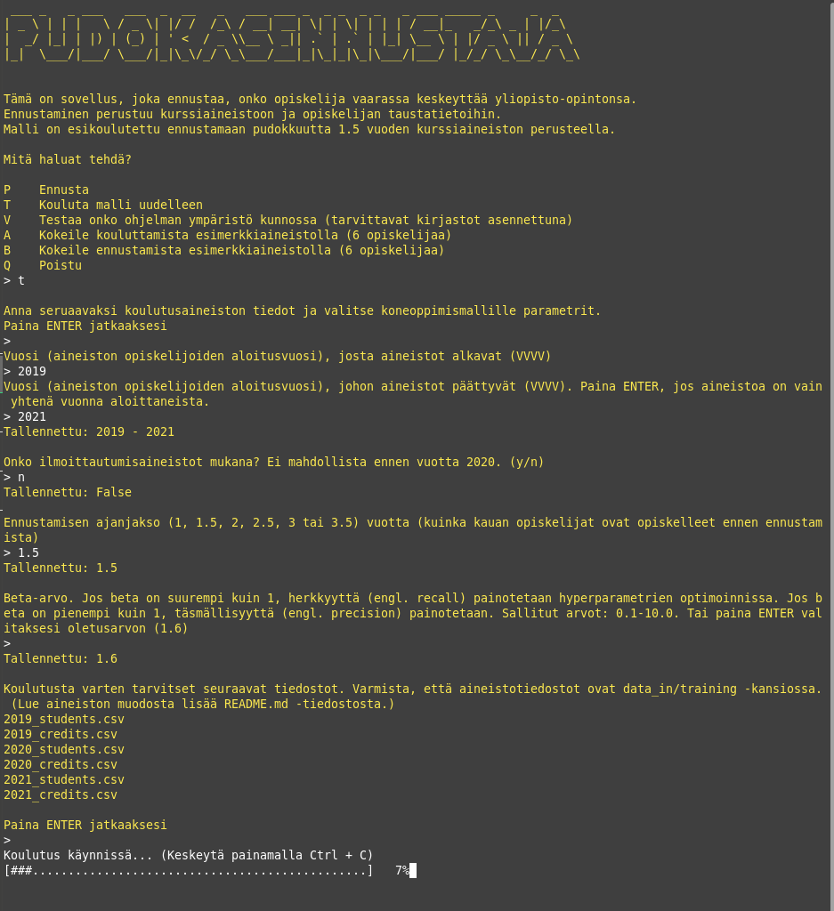

# Pudokasennustaja

## Tekniset vaatimukset

Ohjelmisto tarvitsee toimiakseen pyhon-ympäristön, jossa on tietyt kirjastot asennettuna. Tämän voit luoda esim. condalla tai Dockerilla. Alla ohjeet molempiin.

### Conda
Luo python-ympäristö, jossa on environment.yaml -tiedoston osoittamat kirjastot asennettuna. Esim. condalla: 
```
conda env create -f environment.yaml
conda activate dropout-env
```
Ensimmäinen rivi luo ympäristön, toinen käynnistää sen. Voit sammuuttaa ympäristön ```conda deactivate```.

### Docker

Rakenna Docker-kontti komennolla:
```
docker compose up -d --build
```

## Ohjelman käynnistäminen

### Conda
Aja terminaalissa:
```
conda activate dropout-env
python3 main.py
```

### Docker
```
docker compose run app
```

## Teknisten vaatimusten tarkistaminen

Voit tarkistaa kahdella tavalla, onko kaikki tarpeellinen asennettuna.
1. [Käynnistä ohjelma](#ohjelman-käynnistäminen) ja valitse "V", eli testaa ympäristö.
2. [Käynnistä ohjelma](#ohjelman-käynnistäminen) ja valitse "A", eli testaa kouluttamista esimerkkiaineistolla. Tämän jälkeen valitse "B", eli testaa ennustamista äsken koulutetulla esimerkkimallilla.
3. Jos kumpikin kohta meni läpi ilman virheilmoituksia, ohjelmointiympäristö on kunnossa. Esimerkkiaineiston ennustukset ovat kansiossa ```data_out/samples/```. (Sivuhuomio: esimerkkiaineiston pitäisi tuottaa yltiöpositiivinen ennuste, eli kukaan ei ole pudokas.)

## Aineiston vaatimukset

Aineisto lisätään kahtena tai kolmena ```.csv``` -tiedostona per vuosikurssi ```data_in/``` -kansioon. Tarkemmin joko ```data_in/predicting/``` tai ```data_in/training/``` riippuen siitä, aiotko kouluttaa mallin uudelleen vai tehdä ennusteen.
Ilmoittautumisaineisto on kolmas aineisto eikä se ole pakollinen jos sitä ei haluta käyttää mallissa.

Aineistot annetaan siten, että jokaista vuotta kohden on 2-3 tiedostoa (esim. 2022_students.csv, 2022_credits.csv ja 2022_enrollments.csv).
Vuosi tarkoittaa tässä tapauksessa tuona vuonna opinto-oikeuden saaneita opiskelijoita.

Esimerkki: Vuonna 2022 aloittaneiden opiskelijoiden kurssisuoritustiedot 2022 alkaen 2025 tammikuuhun asti ovat siis tiedostossa 2022_credits.csv jos aineisto luotaisiin tammikuussa 2025.

Kansioissa ```data_in/predicting/samples/``` ja ```data_in/training/samples/``` on esimerkkitiedostot kuvitteellisesti 2023 aloittaneista opiskelijoista.

Huomaa, että .csv tiedostoissa erottimena käytetään puolipistettä. Opiskelija-aineistossa lukukausi-ilmoittautumiset on eroteltu toisitaan pilkuilla.

### Opiskelija-aineisto
Tiedoston nimi: ```vuosi_students.csv```, jossa 'vuosi' on se vuosi muodossa vvvv, jolloin nämä opiskelijat ovat saaneet opinto-oikeutensa.
Formaatti on annettu alla, mutta poista aineistostasi otsikkorivi. Se on vain selkeyden vuoksi.
Formaatti:
```
opisknro;opinto-oik_alku;opinto-oik_loppu;aloituspvm;valmistunut;lukukausi-ilmot;
syntynyt;sukupuoli
a123;2018-08-01;2024-06-19;2018-08-01;true;137:1,138:1,139:3 ... ,1998,1
b124;2017-08-01;2024-06-19;2017-08-01;false;137:1,138:1,139:1 ... ,1980,2
```
### Kurssisuoritusaineisto
Tiedoston nimi: ```vuosi_credits.csv```, jossa 'vuosi' on se vuosi muodossa vvvv, jolloin nämä opiskelijat ovat saaneet opinto-oikeutensa.
Formaatti on annettu alla, mutta poista aineistostasi otsikkorivi. Se on vain selkeyden vuoksi.
```
opisknro;arvosana;opintopisteet;suoritus_pvm;kurssi
a123;4;10;2019-05-08;TKT20001
a123;5;5;2018-12-21;TKT10001
b124;4;5;2018-12-21;TKT10001
```

### Ilmoittautumisaineisto (vapaaehtoinen)
Tiedoston nimi: ```vuosi_enrollments.csv```, jossa 'vuosi' on se vuosi muodossa vvvv, jolloin nämä opiskelijat ovat saaneet opinto-oikeutensa.
Formaatti on annettu alla, mutta poista aineistostasi otsikkorivi. Se on vain selkeyden vuoksi.
```
opisknro;lukukausi;ilm-pvm;kurssi
a123;138;2018-11-01;TKT10001
a123;143;2019-03-01;TKT20001
b124;138;2018-11-01;TKT10001
```

## Ennustaminen

Ohjelmassa tulee mukana yksi esikoulutettu malli. Tämä malli on koulutettu vuosina 2017-2022 opinto-oikeutensa saaneiden opiskelijoiden opintoaineistoilla, jotka on kerätty syyskuussa 2024. Aineisto on leikattu poikki 1.5 vuoden kohdalta, eli jokaiselta opiskelijalta on korkeintaan 1.5 vuoden ajalta kurssiaineistoa.

Käyttääksesi valmista mallia, käynnistä ohjelma ylläolevan ohjeen mukaisesti ja valitse ohjelmasta valinta "Ennusta". Ohjelma kertoo tarkemmin, minkälainen valmiiksi koulutettu malli on. Lisää tarpeelliset aineistot kansioon ```data_in/predicting/```(tässä tapauksessa tiedostot ```vuosi_credits.csv``` ja ```vuosi_students.csv```, jossa vuosi korvataan sillä vuodella, jolloin aineiston opiskelijat ovat saaneet opinto-oikeutensa) ja käynnistä ennustaminen.

## Uudelleen kouluttaminen

Mallin uudelleenkouluttaminen tulee tarpeelliseksi, jos halutaan käyttää eri parametrejä kuin valmismallissa on käytetty. Uudelleenkoulutus on myös aiheellista kun nykyinen aineisto alkaa olla vanhentunutta. Esimerkiksi jos opiskelijoiden kurssikäyttäytyminen, ei-valmistuvien osuus, kurssien läpäisyaste tai arviointi muuttuu rajusti.

Mallin koulutus tapahtuu valitsemalla ohjelmassa "T". Ohjelma kysyy parametrit, joita halutaan käyttää. Lisää aineistot ```data_in/training/``` kansioon ja käynnistä koulutus.


