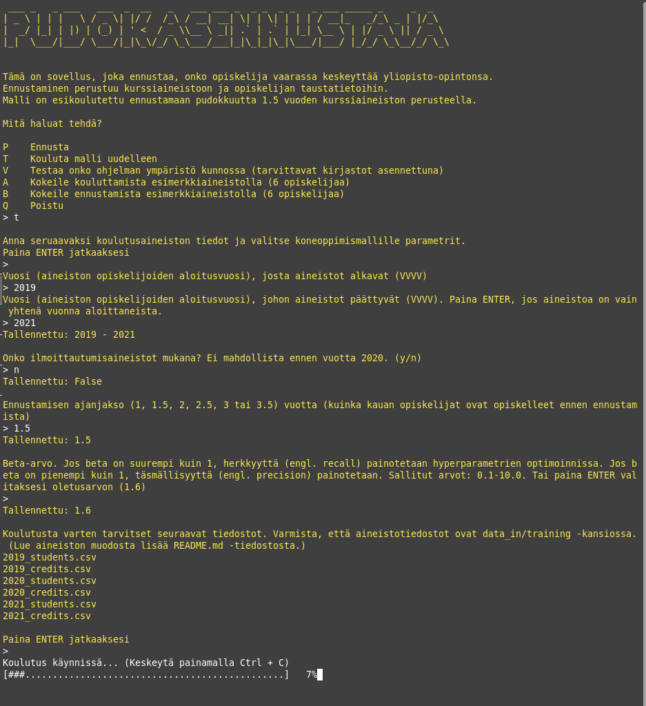

# Pudokasennustaja

## Tekniset vaatimukset

Luo python-ympäristö, jossa on environment.yaml -tiedoston osoittamat kirjastot asennettuna. Esim. condalla: 
```
conda env create -f environment.yaml
conda activate dropout-env
```
Ensimmäinen rivi luo ympäristön, toinen käynnistää sen. Voit sammuuttaa ympäristön ```conda deactivate```.

## Aineiston vaatimukset

Aineisto lisätään kahtena tai kolmena ```.csv``` -tiedostona ```data_in/``` -kansioon.
Ilmoittautumisaineisto on kolmas aineisto eikä se ole pakollinen jos sitä ei haluta käyttää mallissa.

Aineistot annetaan siten, että jokaista vuotta kohden on 2-3 tiedostoa (esim. 2022_students.csv, 2022_credits.csv ja 2022_enrollments.csv).
Vuosi tarkoittaa tässä tapauksessa tuona vuonna aloittaneita opiskelijoita.

Vuonna 2022 aloittaneiden opiskelijoiden kaikki suoritustiedot 2022 alkaen 2025 tammikuuhun asti ovat siis tiedostossa 2022_credits.csv jos aineisto luotaisiin tammikuussa 2025.

Kansiossa ```data_in/samples/``` on esimerkkitiedostot kuvitteellisesti 2023 aloittaneista opiskelijoista.

### Opiskelija-aineisto
Tiedoston nimi: ```vuosi_students.csv```, jossa 'vuosi' on se vuosi muodossa vvvv, jolloin nämä opiskelijat ovat saaneet opinto-oikeutensa.
Formaatti on annettu alla, mutta poista aineistostasi otsikkorivi. Se on vain selkeyden vuoksi.
Formaatti:
```
opisknro;opinto-oik_alku;opinto-oik_loppu;aloituspvm;valmistunut;lukukausi-ilmot;
syntynyt;sukupuoli
a123;2018-08-01;2024-06-19;2018-08-01;true;137:1,138:1,139:3 ... ,1998,1
b124;2017-08-01;2024-06-19;2017-08-01;false;137:1,138:1,139:1 ... ,1980,2
```
### Kurssisuoritusaineisto
Tiedoston nimi: ```vuosi_credits.csv```, jossa 'vuosi' on se vuosi muodossa vvvv, jolloin nämä opiskelijat ovat saaneet opinto-oikeutensa.
Formaatti on annettu alla, mutta poista aineistostasi otsikkorivi. Se on vain selkeyden vuoksi.
```
opisknro;arvosana;opintopisteet;suoritus_pvm;kurssi
a123;4;10;2019-05-08;TKT20001
a123;5;5;2018-12-21;TKT10001
b124;4;5;2018-12-21;TKT10001
```

### Ilmoittautumisaineisto (vapaaehtoinen)
Tiedoston nimi: ```vuosi_enrollments.csv```, jossa 'vuosi' on se vuosi muodossa vvvv, jolloin nämä opiskelijat ovat saaneet opinto-oikeutensa.
Formaatti on annettu alla, mutta poista aineistostasi otsikkorivi. Se on vain selkeyden vuoksi.
```
opisknro;lukukausi;ilm-pvm;kurssi
a123;138;2018-11-01;TKT10001
a123;143;2019-03-01;TKT20001
b124;138;2018-11-01;TKT10001
```

## Ohjelman käynnistäminen
Aja terminaalissa:
```
conda activate dropout-env
python3 main.py
```


